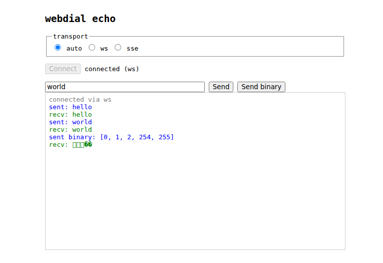

# webdial

`net.Conn` over HTTP. Uses WebSocket when available, falls back to SSE+POST.



Both sides get a standard `net.Conn` (Go) or an equivalent read/write/close interface (JavaScript), so any stream-oriented protocol works over it.

## Go

### Install

```
go get github.com/jpillora/webdial
```

### Server

`*Server` implements `http.Handler`, so mount it directly:

```go
srv := webdial.NewServer()

mux := http.NewServeMux()
mux.Handle("/wd/", srv)

go http.ListenAndServe(":8080", mux)

for {
    conn, err := srv.Accept()
    if err != nil {
        break
    }
    go func() {
        defer conn.Close()
        io.Copy(conn, conn) // echo
    }()
}
```

`srv.Accept()` returns a `net.Conn`. Use it with any protocol that works over a byte stream.

### Client

```go
conn, err := webdial.Dial(ctx, "http://localhost:8080/wd")
if err != nil {
    log.Fatal(err)
}
defer conn.Close()

conn.Write([]byte("hello"))

buf := make([]byte, 1024)
n, err := conn.Read(buf)
fmt.Println(string(buf[:n])) // "hello"
```

`Dial` tries WebSocket first and falls back to SSE+POST automatically. The returned `net.Conn` works the same regardless of transport.

## JavaScript

The ESM client (`client.mjs`) works in both browsers and Node.js 22+. Zero dependencies.

### Install

```
npm install webdial
```

Or use it directly from a `<script type="module">`:

```html
<script type="module">
import { dial } from "/path/to/client.mjs";
</script>
```

### Usage

```js
import { dial } from "webdial";

const conn = await dial("http://localhost:8080/wd");

// Send text
await conn.write("hello");

// Send binary
await conn.write(new Uint8Array([1, 2, 3]));

// Read (returns Uint8Array, or null on close)
const data = await conn.read();
console.log(new TextDecoder().decode(data));

// Close
await conn.close();
```

### Options

Force a specific transport:

```js
const conn = await dial(url, { transport: "ws" });  // WebSocket only
const conn = await dial(url, { transport: "sse" }); // SSE+POST only
```

By default, `dial` tries WebSocket first and falls back to SSE+POST.

### Connection properties

- `conn.transport` — `"ws"` or `"sse"`
- `conn.url` — the base URL used to connect

## Transports

| Transport | Mechanism | Binary | Requirements |
|-----------|-----------|--------|-------------|
| `ws` | WebSocket | native | WebSocket support |
| `sse` | Server-Sent Events (read) + POST (write) | base64 | HTTP/1.1+ |

WebSocket is preferred. SSE+POST is the fallback for environments where WebSocket connections are blocked (e.g. some corporate proxies).

## Protocol

The server is a single `http.Handler` that routes by content-negotiation:

- `Upgrade: websocket` header — WebSocket upgrade, binary frames carry data
- `GET` with `Accept: text/event-stream` — SSE stream; first event is `sid` (session ID), subsequent `d` events carry base64-encoded data, `close` event signals shutdown
- `POST` with `?s=<sid>` — write body bytes to the session; append `&close=1` to close
